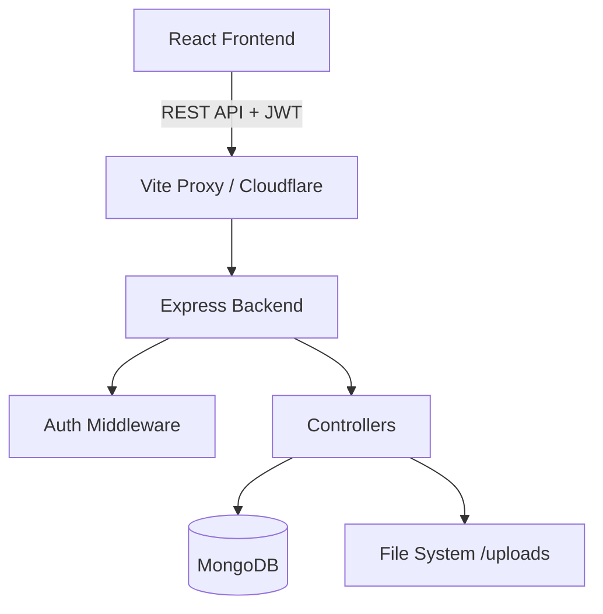

# System Architecture

## High-Level Architecture
CivicPulse operates on a standard MERN (MongoDB, Express, React, Node.js) stack, structured around a stateless RESTful API and a Single Page Application (SPA).

## Frontend (React + Vite)
- **Routing**: `react-router-dom` handles client-side routing.
- **State Management**: React Context (`AuthContext.jsx`) is used for global authentication state. Local component state manages UI interactions.
- **API Client**: Axios (`src/api/axios.js`) is configured as a singleton with an interceptor to automatically attach the JWT token from `localStorage` to all outbound requests.
- **Styling**: Tailwind CSS with custom utility extensions defined in `tailwind.config.js`.

## Backend (Node + Express)
- **Monolithic API**: The backend is a monolith organized by domain entities (`authRoutes`, `userRoutes`, `adminRoutes`).
- **Security Middleware**: 
  - `express-rate-limit` protects against brute force attacks.
  - Custom JWT verification middleware `authMiddleware.js`.
- **File Storage**: Local filesystem via Multer (`middleware/upload.js`). Files are served statically via `/uploads`.
- **Database**: Mongoose ODM providing schema validation and lifecycle hooks.

## Authentication Flow
1. User submits credentials to `/api/auth/login`.
2. Server validates bcrypt hash and issues a signed JWT containing `id`, `username`, `role`, and `state`.
3. Client stores JWT in `localStorage` and updates `AuthContext`.
4. Subsequent requests include `Authorization: Bearer <token>`.
5. Server middleware validates token expiration and signature before allowing access to protected routes.
