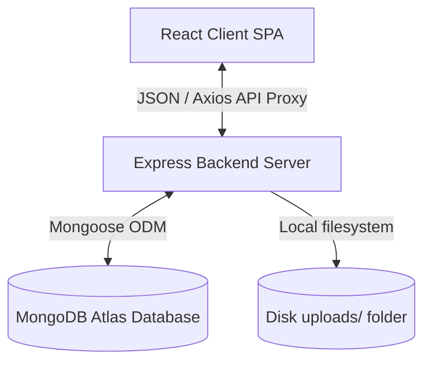
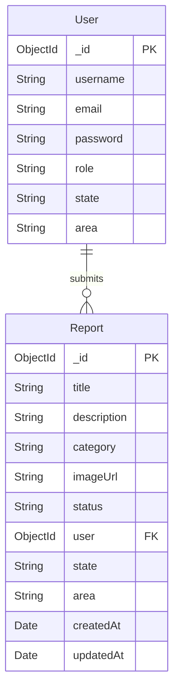
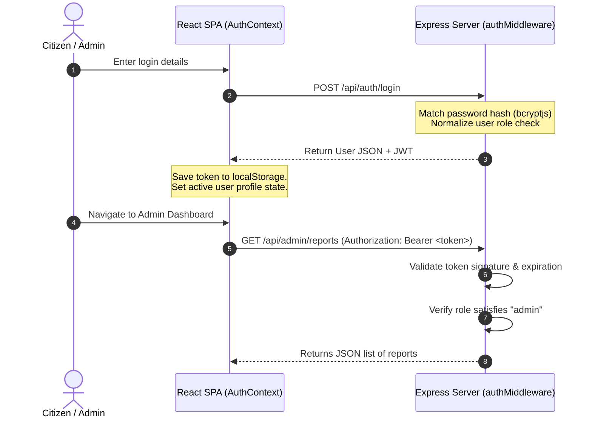

# System Architecture — CivicPulse

This document describes the architectural layout, data flows, routing guard designs, and database models of the CivicPulse application.

---

## 1. High-Level Design (Full Stack Architecture)

CivicPulse is designed as a decoupled client-server application:

- **Vite React Client**: Renders the user interface. It communicates with the backend via relative `/api` paths handled by the Vite dev server proxy in development, and direct HTTP calls in production.
- **Express Backend**: Exposes a stateless REST API.
- **MongoDB**: Acts as the document store, modeling users and reports with referencing relationships.

---

## 2. Database Schema & Relationships

The database is built on two primary MongoDB collections:

### Collection Indexes (Performance Optimizations)
To ensure optimal lookup times on growing datasets, indexes are registered on search fields:
- `Report` collection is indexed on:
  - `user`: For quick retrieval of citizen reports history.
  - `{ state: 1, area: 1 }`: For fast administrative area filtering scans.

---

## 3. Authentication & Route Protection Flow

Authentication utilizes stateless JSON Web Tokens (JWT) signed via HMAC-SHA256:

### Route Protection Architecture
- **Backend Protection**: Endpoints are protected by a chain of middlewares:
  - `authMiddleware`: Extracts the Bearer token, verifies its signature, and appends the decoded payload (`id`, `role`, `state`, `area`) to `req.user`.
  - `requireRole(role)`: Inspects `req.user.role` to ensure it matches the target role constraint before invoking the controller.
- **Frontend Protection**: Handled dynamically via `AuthContext`. If the user is unauthenticated or has a citizen role, they are redirected away from admin views.

---

## 4. API Flow Mapping

- **Auth Router**: Manages login/signup requests.
- **User Router**: Handles citizen issue creation, updating, and deletions. When a citizen uploads an image, the request goes through **Multer** middleware, which saves the file locally in `uploads/` and generates a static URL mapped to `req.body.imageUrl`.
- **Admin Router**: Aggregates statistics counts, retrieves state reports matching the admin's state, and handles deletions and status updates.
