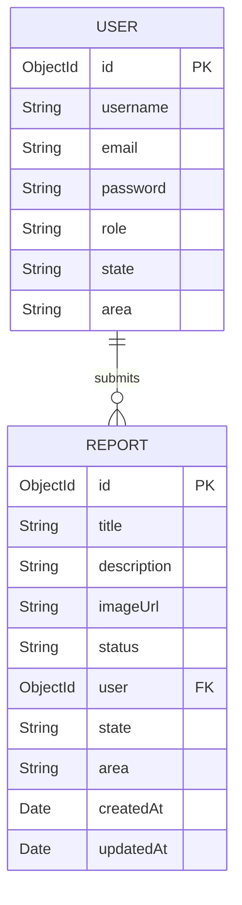
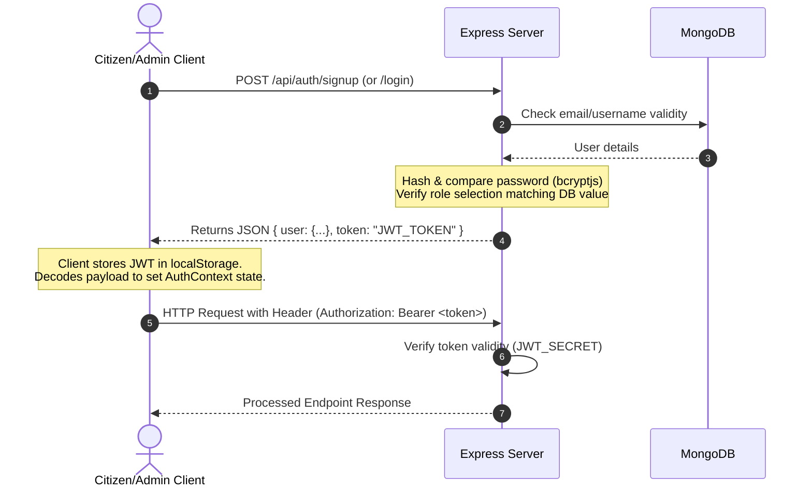

# Project Overview - CivicPulse

## What This Project Does
**CivicPulse** is a crowdsourced municipal issue tracking platform designed to bridge the gap between citizens and local authorities in India. It empowers citizens to report public grievances (e.g., broken roads, lighting issues, waste dumping, water leakage) with descriptions, categories, and photographic evidence. Municipal administrators can then monitor these reports based on their respective state and area jurisdictions, track the resolution process, and update the status of each issue (pending, in-progress, resolved).

---

## Major Features
1. **Role-Based Authentication**:
   - **Citizen User**: Register and log in using state/area parameters, file new reports, track their own submitted reports, and view their profile.
   - **Municipal Admin**: Register and log in for a specific state/area, view all reports submitted within their state, view overall stats on a dashboard, and update/delete reports.
2. **Issue Reporting**:
   - Citizen users can submit reports containing a title, detailed description, category selection, and an optional image attachment.
3. **Citizen Dashboard ("My Reports")**:
   - A personalized list of issues reported by the user, displaying status badges (Pending, In Progress, Resolved) and category icons.
4. **Admin Dashboard**:
   - Visual summary card panel tracking total, pending, active (in-progress), and resolved issues.
   - System status panel monitoring server, database connection, and last updated time.
5. **Admin Operations**:
   - Filter reports by area within their state.
   - Update report status via a management page using the Report ID.
   - Delete inappropriate or invalid reports.

---

## Technology Stack
### Frontend
- **Framework & Runtime**: React 19.1.0 (Vite 6.3.5 dev tool and bundler)
- **Styling**: Tailwind CSS 3.4.17 & PostCSS 8.5.6
- **Routing**: React Router Dom 6.30.1
- **HTTP Client**: Axios 1.11.0 (configured with request interceptor for JWT insertion)
- **Utilities**: Lucide React 0.516.0 (icons), jwt-decode 4.0.0 (JWT reading)

### Backend
- **Framework & Runtime**: Node.js, Express 4.18.2
- **Database Connector**: Mongoose 8.16.0 (MongoDB ODM)
- **Authentication**: bcryptjs 3.0.2 (password hashing), jsonwebtoken 9.0.2 (token signatures)
- **File Upload**: Multer 2.0.1 (multipart form-data parsing for local file system storage)
- **Environment**: dotenv 16.5.0

---

## Architecture
### Frontend Architecture
- **State Management**: React's built-in `Context API` is used. [AuthContext.jsx](file:///c:/Users/Utkarsh%20Pratap/civicpulse/CivicPulse/frontend/src/context/AuthContext.jsx) manages the user authentication state (`user`, `token`, `login`, and `logout` operations).
- **API Connection**: Centralized in [axios.js](file:///c:/Users/Utkarsh%20Pratap/civicpulse/CivicPulse/frontend/src/api/axios.js). Outgoing API calls automatically pick up the JWT from `localStorage` and inject it into the `Authorization` header.
- **Routing & Navigation**: Outlined in [App.jsx](file:///c:/Users/Utkarsh%20Pratap/civicpulse/CivicPulse/frontend/src/App.jsx). It defines the React router structure mapping endpoints to pages.
- **Components**: UI is modular, utilizing the custom-designed [Navbar.jsx](file:///c:/Users/Utkarsh%20Pratap/civicpulse/CivicPulse/frontend/src/components/Navbar.jsx) and full-page layout templates styled using Tailwind utility classes.

### Backend Architecture
- **Entry Point**: [server.js](file:///c:/Users/Utkarsh%20Pratap/civicpulse/CivicPulse/backend/server.js) initializes the application, registers global middlewares (Express JSON parsing, CORS setup, and serving static uploads folder), sets up routers, connects to MongoDB, and launches the HTTP listener.
- **Routing**: Grouped logically:
  - [authRoutes.js](file:///c:/Users/Utkarsh%20Pratap/civicpulse/CivicPulse/backend/routes/authRoutes.js): Login, signup, and token-verification endpoints.
  - [userRoutes.js](file:///c:/Users/Utkarsh%20Pratap/civicpulse/CivicPulse/backend/routes/userRoutes.js): Citizen-facing CRUD endpoints for creating, reading, updating, and deleting reports.
  - [adminRoutes.js](file:///c:/Users/Utkarsh%20Pratap/civicpulse/CivicPulse/backend/routes/adminRoutes.js): Administrative endpoints restricted to admin roles (stats, all reports, status edits, deletions).
- **Controllers**: Grouped under `/controllers/` implementation:
  - [authController.js](file:///c:/Users/Utkarsh%20Pratap/civicpulse/CivicPulse/backend/controllers/authController.js): Registration, hashing, credentials validation, and token signing.
  - [userController.js](file:///c:/Users/Utkarsh%20Pratap/civicpulse/CivicPulse/backend/controllers/userController.js): Handles citizen reports query, creation (mapping files to URLs), edit, and deletion logic.
  - [adminController.js](file:///c:/Users/Utkarsh%20Pratap/civicpulse/CivicPulse/backend/controllers/adminController.js): Aggregates stats, filters reports by admin's state/area, updates statuses, and executes admin deletions.
- **Middlewares**:
  - [authMiddleware.js](file:///c:/Users/Utkarsh%20Pratap/civicpulse/CivicPulse/backend/middleware/authMiddleware.js): Verifies client bearer tokens and guards admin endpoints using role checks.
  - [upload.js](file:///c:/Users/Utkarsh%20Pratap/civicpulse/CivicPulse/backend/middleware/upload.js): Configures Multer storage location (local `uploads/` folder), generates unique filenames with timestamps, and filters by image MIME-types (.jpg, .jpeg, .png).

---

## Database Architecture
The application uses MongoDB as its primary store. The schema configurations are as follows:



### Schemas:
1. **User Schema**:
   - `username`: String (Unique, Required)
   - `email`: String (Unique, Required)
   - `password`: String (Hashed, Required)
   - `role`: String (Enum: `["user", "admin"]`, Default: `"user"`)
   - `state`: String (Required)
   - `area`: String (Optional)
2. **Report Schema**:
   - `title`: String (Required, Trimmed)
   - `description`: String (Trimmed)
   - `imageUrl`: String (Default: `""`)
   - `status`: String (Enum: `["pending", "in-progress", "resolved"]`, Default: `"pending"`)
   - `user`: ObjectId (Reference to `User`, Required)
   - `state`: String (Required)
   - `area`: String (Optional)
   - `timestamps`: Automatically handles `createdAt` and `updatedAt`.

---

## Authentication Flow


---

## API Flow
The REST API endpoints map directly to citizen and admin capabilities:

| HTTP Method | Route Path | Description | Access Level |
| :--- | :--- | :--- | :--- |
| **POST** | `/api/auth/signup` | Register a new user account | Public |
| **POST** | `/api/auth/login` | Validate credentials & return JWT | Public |
| **GET** | `/api/auth/protected` | Test route for validating tokens | Authenticated |
| **GET** | `/api/user/profile` | Retrieve profile info of current user | Authenticated |
| **POST** | `/api/user/report` | Create new issue report (with optional image) | Authenticated |
| **GET** | `/api/user/my-reports` | Retrieve reports created by current user | Authenticated |
| **PUT** | `/api/user/report/:id` | Update title/description of user's report | Authenticated |
| **DELETE** | `/api/user/report/:id` | Delete a report created by current user | Authenticated |
| **GET** | `/api/admin/reports` | Retrieve reports within the admin's state | Admin Only |
| **GET** | `/api/admin/admin/dashboard-stats` | Retrieve municipal issue statistics | Admin Only |
| **PUT** | `/api/admin/report/:id/status` | Update status of a report | Admin Only |
| **DELETE** | `/api/admin/report/:id` | Delete any report on the system | Admin Only |

---

## User Flow
### Citizen User Flow
1. Landing Page -> Clicks "Report an Issue" or "Login/Signup".
2. Authentication -> Authenticates (Registering with State & Area).
3. Dashboard -> Enters private Dashboard ("My Reports").
4. Action -> Clicks "Report Issue", fills out title, description, category, and uploads an image.
5. Tracking -> Views updated list under "My Reports" with status markers.

### Municipal Admin Flow
1. Landing Page -> Clicks "Login/Signup".
2. Authentication -> Enters credentials selecting "Municipal Admin".
3. Redirect -> Enters "All Reports" list showing issues within their registered state.
4. Dashboard -> Switch to "Admin Dashboard" to see statistics (Total, Pending, Active, Resolved).
5. Review -> Filter reports list by Area to spot specific local grievances.
6. Operation -> Copy a report's ID and navigate to "Update Status" to advance its resolution state.

---

## Deployment Architecture
- **Backend**: Deployed as a Node service on Render. Configured via `render.yaml` to build using `npm install` and run with `npm start`.
- **Frontend**: Configured for deployment on Vercel. Router paths are mapped in `vercel.json` to route all traffic back to `index.html` to allow client-side routing.

---

## Folder Structure Explanation
```
CivicPulse/
├── backend/                       # Server-side application directory
│   ├── controllers/               # Business logic handlers
│   │   ├── adminController.js     # Admin dashboards and updates
│   │   ├── authController.js      # User registration & verification
│   │   └── userController.js      # Citizen CRUD operations
│   ├── middleware/                # Route interceptors
│   │   ├── authMiddleware.js      # Bearer token & role checking
│   │   └── upload.js              # Multer configuration for file uploads
│   ├── models/                    # Mongoose database models
│   │   ├── Report.js              # Issue schema definition
│   │   └── User.js                # Account schema definition
│   ├── routes/                    # API path endpoints definitions
│   │   ├── adminRoutes.js         
│   │   ├── authRoutes.js          
│   │   └── userRoutes.js          
│   ├── uploads/                   # Local folder storing uploaded image assets
│   ├── .env                       # Backend local configuration credentials
│   ├── package.json               # Backend dependencies list
│   └── server.js                  # App main startup file
├── frontend/                      # Client-side web application directory
│   ├── public/                    # Static assets folder
│   ├── src/                       # React source files
│   │   ├── api/                   
│   │   │   └── axios.js           # Base Axios setup & token interceptor
│   │   ├── components/            
│   │   │   └── Navbar.js          # Navigation bar component
│   │   ├── context/               
│   │   │   └── AuthContext.jsx    # Global authentication provider
│   │   ├── pages/                 # Routing page views
│   │   │   ├── AdminDashboard.jsx # Stats and platform overview
│   │   │   ├── AllReports.jsx     # Admins list of state issues
│   │   │   ├── Home.jsx           # Public landing page
│   │   │   ├── Login.jsx          # Login form
│   │   │   ├── MyReports.jsx      # Citizen dashboard
│   │   │   ├── Report.jsx         # Issue reporting form
│   │   │   ├── Signup.jsx         # Registration form
│   │   │   ├── UpdateReportStatus.jsx # Admin status editor
│   │   │   └── UserProfile.jsx    # Authenticated user details
│   │   ├── App.jsx                # Router element setup
│   │   ├── index.css              # Main global style file
│   │   └── main.jsx               # React virtual DOM anchor
│   ├── .env                       # Frontend local configuration credentials
│   ├── package.json               # Frontend dependencies list
│   ├── tailwind.config.js         # Tailwind styling configs
│   └── vite.config.js             # Vite build settings & dev server proxy config
├── render.yaml                    # Render cloud deployment settings
└── PROJECT_OVERVIEW.md            # Architecture and project summary report
```

---

## Technical Debt Summary

### 1. Database Schema Mismatch (Critical Bug)
- **Description**: The citizen report form submits a `category` parameter, and [userController.js](file:///c:/Users/Utkarsh%20Pratap/civicpulse/CivicPulse/backend/controllers/userController.js) explicitly reads `category` from `req.body` and passes it to the `Report` document. However, the Mongoose [Report.js](file:///c:/Users/Utkarsh%20Pratap/civicpulse/CivicPulse/backend/models/Report.js) schema has **no category field**.
- **Impact**: MongoDB ignores the field during save, resulting in category data being discarded. This causes all reports in the citizen and admin views to show up as "Uncategorized" in the UI.

### 2. Admin Dashboard Aggregation Bug (Critical Bug)
- **Description**: In [AdminDashboard.jsx](file:///c:/Users/Utkarsh%20Pratap/civicpulse/CivicPulse/frontend/src/pages/AdminDashboard.jsx), lines 177, 221, and 259 all use `stats?.total?.toLocaleString()` to output counts for "Pending Review", "In Progress", and "Resolved".
- **Impact**: The UI displays the total count on all statistic cards. For example, if there are 10 total reports, all categories display "10". It should refer to `stats.pending`, `stats.inProgress`, and `stats.resolved`.

### 3. Local Proxy and API URL Misconfiguration (Configuration Issue)
- **Description**: The backend defaults to port `10000` (since `PORT` is not defined in `backend/.env`). However, the frontend's [vite.config.js](file:///c:/Users/Utkarsh%20Pratap/civicpulse/CivicPulse/frontend/vite.config.js) configures its API proxy to point to `http://localhost:5000`.
- **Impact**: Any attempt to use standard API proxying will fail locally due to the port mismatch. In addition, the frontend's [frontend/.env](file:///c:/Users/Utkarsh%20Pratap/civicpulse/CivicPulse/frontend/.env) points `VITE_API_URL` directly to the production Render URL (`https://civicpulse-backend-nq4h.onrender.com/api`), making local development modify live production databases.

### 4. Broken Protected Route Username Call (Minor Bug)
- **Description**: In [authRoutes.js](file:///c:/Users/Utkarsh%20Pratap/civicpulse/CivicPulse/backend/routes/authRoutes.js) on line 11, the `/api/auth/protected` route sends `message: Hello ${req.user.name}, you're authenticated.`.
- **Impact**: Since the token generator payload only saves `username` (not `name`), this results in `Hello undefined, you're authenticated`.

### 5. Static Mobile Navigation Menu (UI/UX Issue)
- **Description**: The [Navbar.jsx](file:///c:/Users/Utkarsh%20Pratap/civicpulse/CivicPulse/frontend/src/components/Navbar.jsx) component contains the markup for a hamburger menu icon visible on mobile viewport widths. However, it lacks React state and onClick handlers to render or toggle a mobile menu dropdown.
- **Impact**: Mobile users are completely unable to access subpages (Report Issue, My Reports, Profile, Admin Dashboard, etc.) because the nav links vanish on narrow screens and the hamburger button is non-functional.

### 6. Suboptimal Admin Workflow
- **Description**: To update a report's status, administrators must copy the raw string MongoDB ObjectId from the "All Reports" list, navigate to the "Update Status" page, paste the ID into an input box, select the new status, and click submit.
- **Impact**: High friction administrative workflow. It should have inline action triggers or status selection menus directly on each report card.

### 7. Security and Validation Gaps
- **Description**: 
  - There is no sanitization or input validation validation in the controller layer (e.g., checking if email is properly formatted, minimum username/password length, or sanitizing description fields).
  - The backend's `.env` configuration contains active connection strings with embedded MongoDB credentials.
  - The JWT secret key `yourVerySecretKey123` is weak and hardcoded in the `.env` version that was checked into the git repository.
