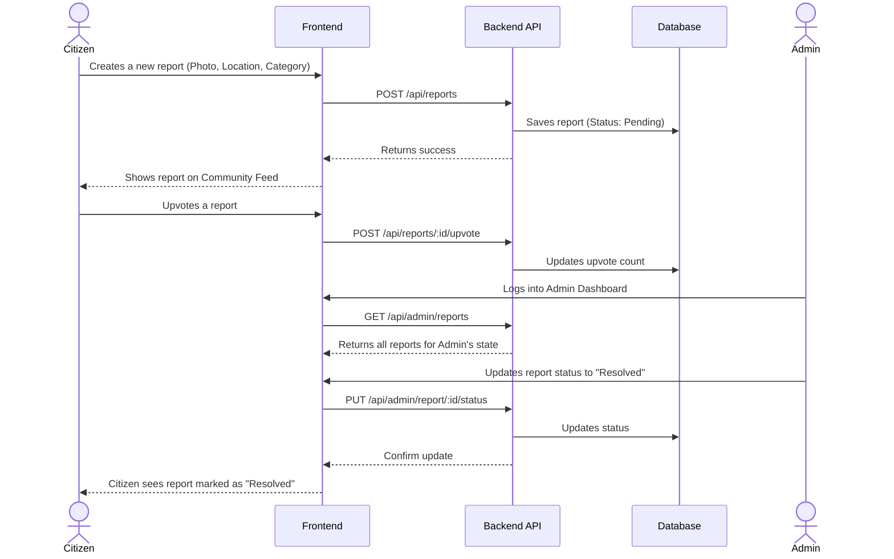

# CivicPulse

An urban anomaly reporting and civic engagement platform designed to empower citizens and streamline municipal maintenance.

## 🌟 Overview

CivicPulse bridges the gap between citizens and municipal caretakers. It allows individuals to report, discuss, and support resolutions for urban anomalies (like broken streetlights, potholes, and sanitation issues), while providing a robust administrative dashboard for authorities to triage and manage these reports.

## 📸 Snapshots

> **Note**: Add your actual UI screenshots to the `docs/images` folder and name them `feed.png` and `dashboard.png` to have them show up below!

### Community Feed (Mobile-First)
The community feed allows citizens to browse and upvote issues reported in their area, fostering a sense of civic engagement.


### Admin Dashboard
A sleek, dark-mode dashboard for municipal authorities to track metrics and update the status of reports from Pending to Resolved.


## 🔄 System Flow

The diagram below illustrates the typical flow of data and actions within CivicPulse, from a citizen reporting an issue to an admin resolving it.



## 🏗️ Architecture & Tech Stack

```mermaid
graph TD
    Client[Client Browser / Mobile] -->|React + Tailwind CSS| Frontend
    Frontend -->|REST API Calls (Axios)| Backend
    Backend -->|Express + Node.js| DB[(MongoDB)]
    
    subgraph Frontend Architecture
    UI(React Components) --> Context(State Management)
    Context --> API_Req(API Services)
    end

    subgraph Backend Architecture
    Router(Express Routes) --> Auth(Auth Middleware)
    Auth --> Controller(Business Logic)
    Controller --> Model(Mongoose Models)
    end
```

### Core Technologies
- **Frontend**: React (v19), Vite, Tailwind CSS, Lucide React, Axios.
- **Backend**: Node.js, Express, MongoDB, Mongoose.
- **Authentication**: JWT-based stateless authentication with Role-Based Access Control (RBAC).
- **Security**: Express Rate Limiting, Multer File Size Limits, CORS, Bcrypt Password Hashing.

## 🚀 Key Features

- **Citizen Reporting**: Document local decay with photos, geolocation, and categorized tags.
- **Community Feed**: Discover and browse reports made by other citizens within your state.
- **Social Support**: Upvote and comment on issues that matter to your neighborhood.
- **Administrative Triage**: Dedicated admin dashboard to track metrics and update report statuses.
- **Responsive Architecture**: Mobile-first, premium minimalist interface powered by Tailwind CSS.

## 🛠️ Getting Started

### Prerequisites
- Node.js (v20+)
- MongoDB (Local or Atlas)

### Installation
1. **Clone the repository:**
   ```bash
   git clone https://github.com/netacodes18/CivicPulse.git
   cd CivicPulse
   ```
2. **Install dependencies:**
   ```bash
   cd frontend && npm install
   cd ../backend && npm install
   ```
3. **Environment Setup:**
   - Create a `.env` file in the `backend` directory (see `.env.example`).
   - Create an `.env` file in the `frontend` directory with `VITE_API_URL=http://localhost:10000`.
4. **Start development servers:**
   ```bash
   # Terminal 1 (Backend)
   cd backend && npm run dev
   
   # Terminal 2 (Frontend)
   cd frontend && npm run dev
   ```

## 📚 Detailed Documentation

- [Architecture Guide](ARCHITECTURE.md)
- [API Documentation](API_DOCUMENTATION.md)
- [Database Schema](DATABASE_SCHEMA.md)
- [Deployment Guide](DEPLOYMENT_GUIDE.md)
- [Feature Details](FEATURE_DOCUMENTATION.md)
